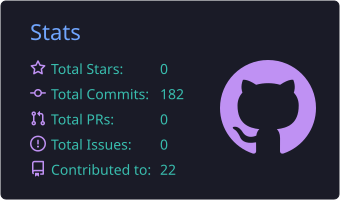
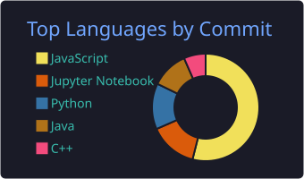
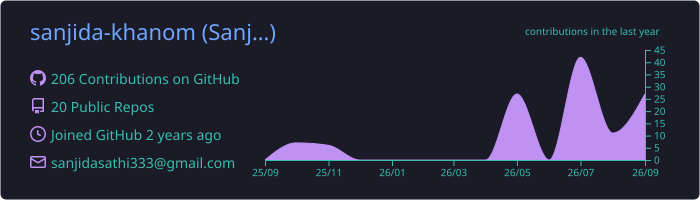
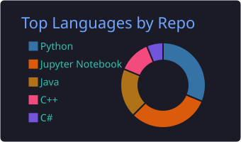
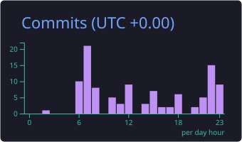

 

## About Me

<table>
<tr>
<td width="58%" valign="middle">

I am a **Computer Science and Engineering graduate** from BUBT, working where **AI meets security**.

I build **agentic and retrieval-augmented AI systems**, test them against **prompt injection and adversarial attacks**, and apply deep learning to **real cyber threats**.

 

| Role | Organization |
| :--- | :--- |
| **Research Assistant** | Al-Hikmah Research Lab |
| **Student Researcher** | Cyber Research Hub, BUBT |

</td>
<td width="42%" align="center" valign="middle">

</td>
</tr>
</table>

<b>More about me</b>

 

- **Previously:** Research Assistant Intern at Peer Research Lab, and Teaching Assistant in the CSE Department at BUBT for a full academic year
- **Education:** B.Sc. in CSE, Bangladesh University of Business and Technology, CGPA 4.00 / 4.00
- **Approach:** build it, measure it, then try to break it. I care about work that is reproducible, explainable and measured
- **Long-term goal:** a PhD in trustworthy and secure AI

## Focus Areas

<table>
<tr>
<td width="25%" valign="top">

**Agentic & Generative AI**

RAG pipelines, hybrid retrieval, LLM agents with LangGraph

</td>
<td width="25%" valign="top">

**AI Security**

Prompt injection, adversarial ML, model evasion, MITRE ATLAS

</td>
<td width="25%" valign="top">

**Cybersecurity**

Ransomware, malicious URLs, network intrusion detection

</td>
<td width="25%" valign="top">

**Machine & Deep Learning**

Explainable AI, graph and federated learning, medical vision

</td>
</tr>
</table>

## Selected Projects

| Project | Area | Highlight |
| :--- | :--- | :--- |
| [**Enterprise Knowledge Assistant**](https://github.com/sanjida-khanom/enterprise-rag-agent-triage-langgraph) | Agentic AI · RAG | Hybrid retrieval with cited answers and a LangGraph agent |
| [**RAG Prompt Injection Demo**](https://github.com/sanjida-khanom/RAG-injection-demo_MITRE_ATLAS_Application) | AI Security | Injection mapped end to end to MITRE ATLAS |
| [**ML Classifier Evasion Demo**](https://github.com/sanjida-khanom/ML-evasion-demo_MITRE_ATLAS_Application) | AI Security | Detection 94% → 16% → 46% after defence |
| [**Ransomware Detection**](https://github.com/sanjida-khanom/A-Hybrid-Static-and-Dynamic-Analysis-Framework-for-Real-Time-Ransomware-Detection) | Cybersecurity | 99.60% accuracy, AUC 0.9997 |
| [**Malicious URL Detection**](https://github.com/sanjida-khanom/Malicious-URL-Detection-Hierarchical-Multi-View-Graph-Learning-) | Cybersecurity · GNN | 98.91% threat isolation on 36,707 URLs |
| [**HemaVision**](https://github.com/sanjida-khanom/HemaVision-WBC-Classification-XAI) | Deep Learning · XAI | 0.9976 Macro-AUC, accepted at IEEE CSDE 2026 |

<b>Project details and tech stack</b>

 

**Enterprise Knowledge Assistant** 
Grounded question answering over HR, finance and network-operations documents. Dense search and BM25 run in parallel and are fused with Reciprocal Rank Fusion, every answer carries citations, and refusal is a measured metric. Includes a LangGraph tool-using agent. 
LangChain · LangGraph · ChromaDB · FastAPI

**RAG Prompt Injection Demo** 
Reproduces an indirect prompt injection against a local RAG assistant: a hidden instruction in a reference document is retrieved and followed. Every stage is mapped to its MITRE ATLAS technique, then mitigated with sanitisation. 
Python · Ollama · sentence-transformers

**ML Classifier Evasion Demo** 
Black-box adversarial evasion against a locally trained classifier using IBM ART, then defended with adversarial training. 
PyTorch · IBM ART · scikit-learn

**Ransomware Detection** 
Hybrid static and dynamic analysis optimised with an Adaptive Grey Wolf Optimizer (A-GWO). Early detection fires from only the first three API calls. 
scikit-learn · LightGBM · SHAP · LIME

**Malicious URL Detection** 
Two-stage hierarchical multi-view graph framework with leakage-free GraphSMOTE and soft-voting fusion across three graph architectures. 
PyTorch Geometric · GCN · GAT · GraphSAGE

**HemaVision** 
Explainable white blood cell classification with an EfficientNetV2-B0 backbone and CBAM attention. Grad-CAM heatmaps feed automated Clinical Decision Reports. 99.04% validation accuracy. 
PyTorch · timm · CBAM · Grad-CAM

<b>More projects</b>

 

| Project | Area | Description |
| :--- | :--- | :--- |
| [**RT-DeepNIDS**](https://github.com/sanjida-khanom/RT-DeepNIDS-A-Real-Time-Hybrid-Network-Intrusion-Detection-System-for-IT-and-IoT-Environments) | Cybersecurity | Real-time hybrid intrusion detection for IT and IoT |
| **Federated Threat Detection** | GNN · FL | GCN, GAT and GraphSAGE under federated optimizers |
| **Anomaly Detection (UNSW-NB15)** | Cybersecurity | Deep autoencoder + HDBSCAN for unsupervised NIDS |
| **Steganography Detection** | Security · CV | Dual-stream architecture with LSB bit-plane extraction |

## Publications

| Accepted Paper | Venue |
| :--- | :--- |
| Multi-LLM Consensus Framework for Evaluating Banking-Sector NIDS Coverage of MITRE ATT&CK | ML4CS 2026 · Springer LNCS |
| Hybrid Static and Dynamic Ransomware Detection using A-GWO | ML4CS 2026 · Springer LNCS |
| Hierarchical Multi-View Graph Learning for Malicious URL Detection | IEEE SPICSCON 2026 |
| HemaVision: Explainable AI for White Blood Cell Classification | IEEE CSDE 2026 |
| Explainable Meta-Learning for Air Quality Prediction | IEEE SPICSCON 2026 |

<b>Under review, published work and blogs</b>

 

**Under Review**
- DynamicFusionNet: explainable hate speech detection · *Expert Systems with Applications (Elsevier)*
- Synchronized Daily Electricity Demand Dataset for Dhaka · *Data in Brief (Elsevier)*

**Published**
- [Optical Conveyance of Audio Signals with Li-Fi](https://journal.hmjournals.com/index.php/JEET/article/view/3859) · *JEET*
- [Multi-Feature Daily Electricity Demand Dataset, Dhaka](https://data.mendeley.com/datasets/3crvdfyvvp/1) · *Mendeley Data*

**Blogs**
- [MITRE ATLAS in Action: Two Hands-On Walkthroughs in AI Security](https://cms.cyberresearch.bubt.edu.bd/mitre-atlas-in-action-two-hands-on-walkthroughs-in-ai-security/)
- [Malicious File Analysis: Wireshark Meets VirusTotal](https://cms.cyberresearch.bubt.edu.bd/elementor-3094/)

## Tech Stack

<b>Full tech stack by domain</b>

 

**Agentic & Generative AI** 

**AI Security & Cybersecurity** 

**Machine & Deep Learning** 

**Data & Deployment** 

<table>
<tr>
<td width="50%" valign="top">

### Achievements

- **Dean's Award for Academic Excellence** BUBT, Spring 2025
- **3rd Position, Research-Oriented Competitive Coding 2026** BUBT Research Graduate School
- **6th Position, BIUCTF 2026** Capture the Flag
- **Google Certifications** AI for Research and Insights · AI Fundamentals

</td>
<td width="50%" valign="top">

### Leadership & Community

- **General Secretary** IEEE WIE BUBT Affinity Group
- **Event Coordinator** IEEE BUBT Student Branch
- **Organizer** Cybersecurity & Leadership Seminars
- **Technical Volunteer & Room Coordinator** ICPC Asia Dhaka Regional

</td>
</tr>
</table>

## GitHub Activity

  

  

<picture>
  <source media="(prefers-color-scheme: dark)" srcset="https://raw.githubusercontent.com/sanjida-khanom/sanjida-khanom/output/github-contribution-grid-snake-dark.svg" />
  <source media="(prefers-color-scheme: light)" srcset="https://raw.githubusercontent.com/sanjida-khanom/sanjida-khanom/output/github-contribution-grid-snake.svg" />
  
</picture>

<b>Contribution graph and more stats</b>

 

  

---

